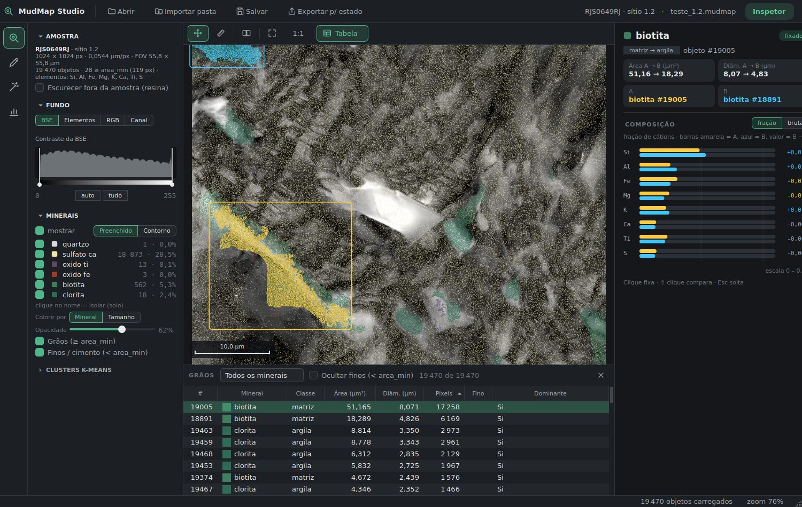
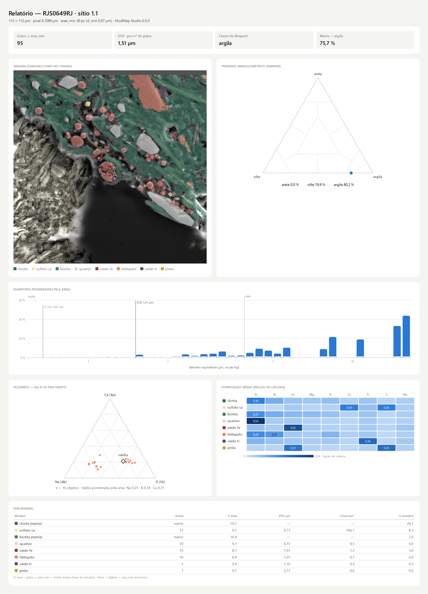

# MudMap

O MudMap é um software destinado ao mapeamento e à classificação mineralógica de imagens obtidas por microscopia eletrônica de varredura (MEV), com foco na caracterização de rochas sedimentares analisadas em lâminas petrográficas.

O software permitirá a identificação e classificação dos minerais presentes nas amostras a partir da integração de diferentes mapas elementares obtidos por espectroscopia de raios X por dispersão de energia (EDS). Como as lâminas petrográficas são confeccionadas com resina epóxi, o sistema também contará com uma etapa de correção dos teores de carbono e oxigênio associados à resina, de modo a minimizar sua influência na classificação mineralógica.

A classificação dos minerais será realizada por meio de técnicas de aprendizado de máquina, considerando tanto as composições químicas teóricas e características de cada mineral, quanto dados reais provenientes de um banco de dados de referência. Dessa forma, o MudMap será capaz de integrar os dados elementares obtidos por EDS e, a partir das assinaturas químicas identificadas, atribuir classes mineralógicas aos diferentes pixels ou regiões da imagem.

O objetivo é desenvolver, portanto, uma ferramenta capaz de automatizar e tornar mais consistente o processo de interpretação mineralógica de imagens de MEV-EDS, permitindo a geração de mapas mineralógicos quantitativos e a caracterização da distribuição espacial dos minerais em rochas sedimentares.



## O que tem aqui

- **MudMap Studio** (`app/`): aplicativo de desktop para inspecionar, editar, segmentar e gerar o
  relatório de uma amostra. Modos **Inspetor** (clique num grão → área, diâmetro, composição),
  **Edição** (pincel, borracha, balde, polígono, laço, pontos → regiões, propagar, desfazer),
  **Segmentar** (candidato pelas regras da config, comparação IoU/Dice, calibração, k-means) e
  **Relatório** (Shepard, D50, composição por mineral, ternário Na-K-Ca de feldspatos; PNG/SVG/CSV/JSON/HTML).
- **Pipeline por linha de comando** (`scripts/`): as mesmas etapas em scripts determinísticos,
  pensados para serem conduzidos pelo **Claude** numa conversa (ver [SKILL.md](.claude/skills/mudmap/SKILL.md)).
- **Dados reais**: amostra RJS0649RJ, sítios 1.1 e 1.2 — mapas EDS do AZtec (`EDS/`), estado da
  segmentação (`estado/`, `sitios/`), regras calibradas (`config/`) e pacotes prontos (`amostras/*.mudmap`).
- **Exemplo sintético**: um projeto completo gerado por código, para testar tudo sem dados reais.

## Como baixar e usar

### 1. Só o aplicativo (Windows, sem instalar Python)

1. Baixe **`MudMapStudio-windows.zip`** na página de
   [Releases](https://github.com/mateusandrade-geo/MudMap/releases/latest)
   (ou, antes do primeiro release, no artefato da última execução em
   [Actions](https://github.com/mateusandrade-geo/MudMap/actions) — precisa estar logado no GitHub).
2. Extraia o ZIP e rode `MudMapStudio\MudMapStudio.exe`.
3. Na tela inicial: **"Primeira vez? Abrir o exemplo sintético"**, ou **Abrir .mudmap** com um dos
   pacotes reais (`RJS0649RJ_1.1.mudmap`, `RJS0649RJ_1.2.mudmap`, também no Release e em `amostras/`),
   ou **Importar pasta do projeto** apontando para a pasta deste repositório (lê os mapas do AZtec direto).

> O Windows pode avisar que o app não é assinado ("O Windows protegeu o computador"):
> clique em **Mais informações → Executar assim mesmo**.

### 2. Pelo código-fonte (Windows, Linux ou macOS)

Precisa do [Python 3.10 ou mais novo](https://www.python.org/downloads/) — testado no 3.11 e no 3.12 (no Windows, marque *Add python.exe to PATH*).

1. Baixe o repositório: botão **Code → Download ZIP** (ou `git clone https://github.com/mateusandrade-geo/MudMap.git`).
2. Abra o app:
   - **Windows:** duplo clique em **`MudMapStudio.bat`**
   - **Linux/macOS:** `./mudmap_studio.sh` (ou `./mudmap_studio.sh --exemplo`)

   Na primeira vez ele cria o ambiente `.venv` e instala as dependências (alguns minutos, precisa de internet).

Manualmente, se preferir:

```bash
python -m venv .venv
source .venv/bin/activate          # Windows: .venv\Scripts\activate
pip install -r requirements.txt
python app/run_studio.py           # ou: python app/run_studio.py amostras/RJS0649RJ_1.1.mudmap
```

### 3. Com o Claude

O fluxo de segmentação foi feito para ser conduzido pelo Claude: ele roda os scripts, mostra as
prévias, resume os números e só grava o que você aprovar. As instruções ficam em
[`.claude/skills/mudmap/SKILL.md`](.claude/skills/mudmap/SKILL.md).

- **Claude Code:** clone o repositório, abra o Claude Code na pasta e peça, por exemplo,
  *"liste os sítios e segmente o quartzo do sítio ativo"*. O `CLAUDE.md` e a skill são carregados
  sozinhos.
- **claude.ai (com execução de código ligada):** envie o **`MudMap-skill.zip`** do
  [Release](https://github.com/mateusandrade-geo/MudMap/releases/latest) como skill
  (Configurações → Capacidades → Skills) e anexe seus mapas EDS na conversa. Também dá para baixar só o
  [SKILL.md](https://raw.githubusercontent.com/mateusandrade-geo/MudMap/main/.claude/skills/mudmap/SKILL.md):
  ele manda o Claude buscar o código no GitHub.

## Dados e projeto

```
config/classificacao.yaml   regras dos minerais do sítio ATIVO (ordem = prioridade)
estado/                     segmentação do sítio ativo: rotulos.npy (0 = livre, 1..N = mineral),
                            progresso.json, clusters.npy/.json, rotulos_prev.npy (desfazer)
sitios/<s>/                 sítios arquivados (estado + config + info.json)
EDS/1/1.1, EDS/1/1.2        mapas do AZtec: "<El> Wt% Map Data N.tif" + "Electron Image N.tif"
amostras/*.mudmap           um pacote por sítio (abre direto no app)
```

- Ver/trocar o sítio ativo: `python scripts/ativar_sitio.py --listar` e `python scripts/ativar_sitio.py 1.1`.
- Dados novos: coloque os TIFFs exportados do AZtec (um por elemento + a Electron Image) em
  `EDS/<amostra>/<sítio>/` e siga "Novo sítio" no [SKILL.md](.claude/skills/mudmap/SKILL.md).
  O tamanho do pixel é lido dos metadados do TIFF (`pixel_um: auto`).
- Exemplo sintético: `python scripts/gerar_exemplo.py` cria `exemplo/` (projeto separado; rode os
  scripts de dentro dele, `python ../scripts/reconhecer.py`).

## Pipeline por linha de comando

Rode na raiz do projeto. Passo a passo completo e regras de uso no [SKILL.md](.claude/skills/mudmap/SKILL.md).

| Etapa | Script |
|---|---|
| Reconhecimento (k-means, sem commitar) | `reconhecer.py`, `candidatos.py` |
| Segmentar um mineral por vez | `segmentar.py --mineral <m> --previa` / `--auto` |
| Revisar | `revisar_commit.py`, `remover_objeto.py`, `revisar_pontos.py`, `mapa_atual.py` |
| Calibrar a regra | `comparar.py --mineral <m> --calibrar` |
| Resultados | `exportar_graos.py` (inspetor HTML), `relatorio_final.py --previa`, `exportar_mudmap.py` |
| Sítios | `arquivar_sitio.py`, `ativar_sitio.py` |
| Editores napari (opcionais) | `segmentar.py` sem `--auto`, `editor_completo.py`, `propagar.py`, `revisar_regioes.py`, `ancorar_centros_bse.py` — `pip install -r requirements-napari.txt` |

A classificação é **determinística**: regras estequiométricas sobre frações de cátion (sem O e C),
modelos por região e k-means com semente fixa — o mesmo dado gera sempre o mesmo resultado.



## Testes e build

```bash
python app/testes/validar_nucleo.py                  # núcleo do app × scripts (dados reais do sítio ativo)
QT_QPA_PLATFORM=offscreen python app/testes/testar_interface.py saida/testes_ui   # interface, sem tela
python app/run_studio.py --autoteste amostras/RJS0649RJ_1.1.mudmap saida/auto.png .
```

O executável do Windows é gerado por `app/build_exe.ps1` (PyInstaller):

```powershell
powershell -ExecutionPolicy Bypass -File app\build_exe.ps1 -Saida C:\MudMapStudio -Zip
```

A cada push o GitHub Actions ([`.github/workflows/mudmap.yml`](.github/workflows/mudmap.yml)) roda os
testes (dados reais + exemplo), gera o `.exe`, valida-o com `--autoteste` e monta o `MudMap-skill.zip`.
Ao criar uma tag `v*` (ex.: `v0.5.0`), publica tudo num Release.
